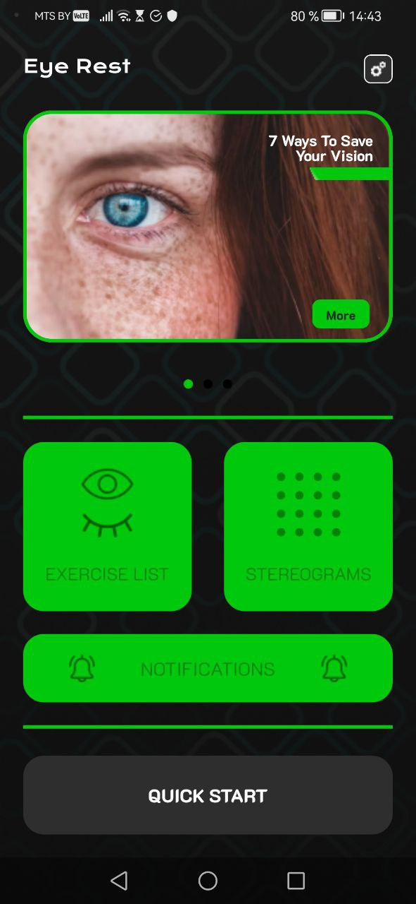
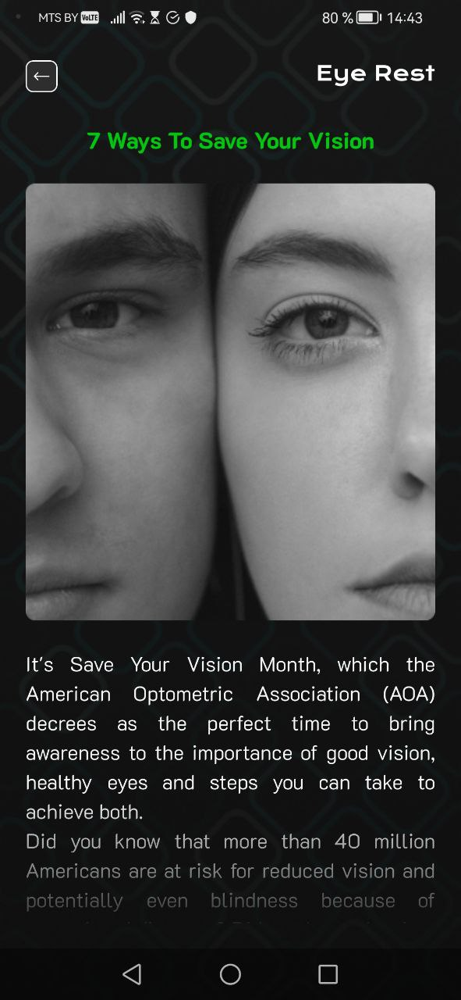
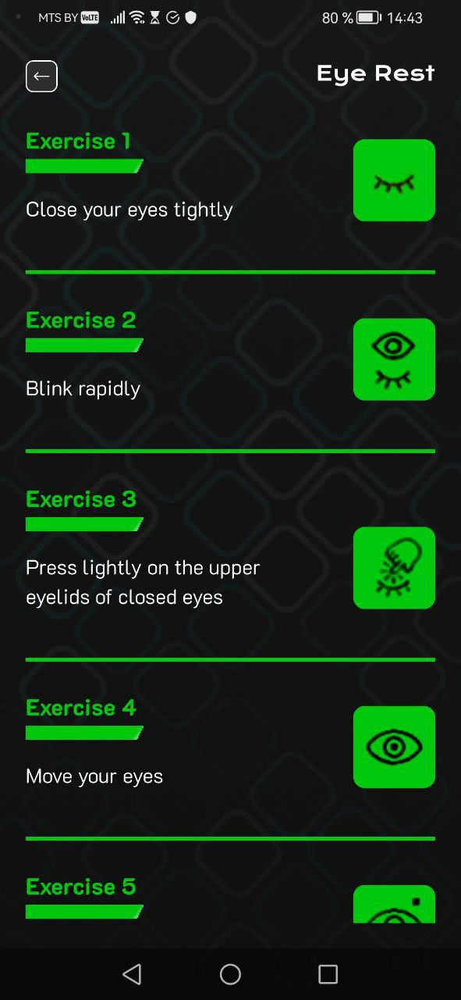
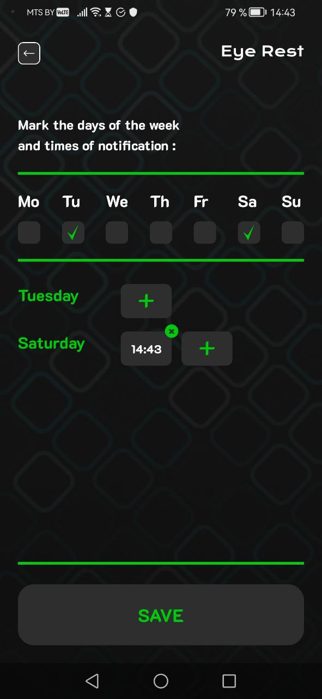
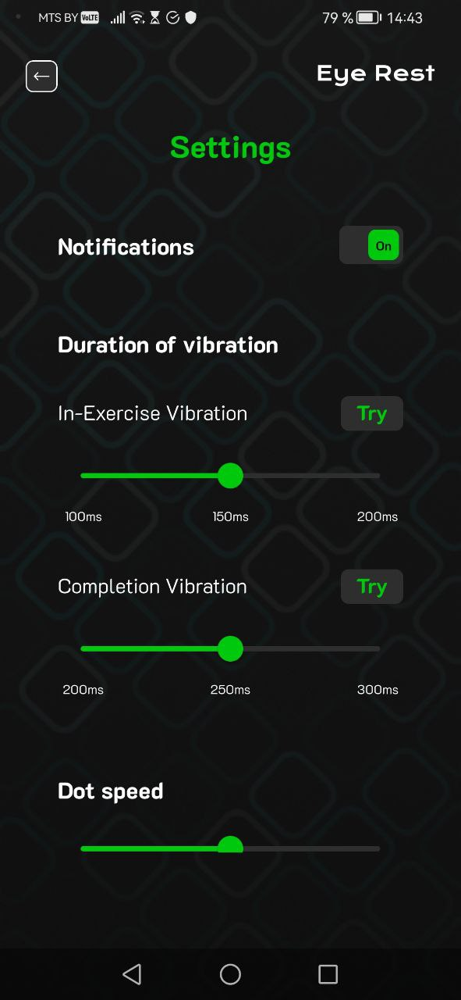
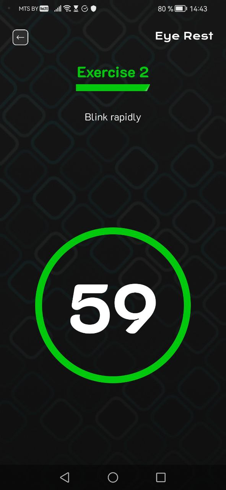

Приложение EyeRest для расслабления глаз после нагузки.

Состоит из 3 основных вкладок: main(основная страница), articles(статьи о зрении с текстом и картинками) и exercises list(список упражнений), exercise(какое-то отдельное упражнение), notifications(страница настройки уведомлений) и settings(настройки) .

|При запуске приложения открывается основная страница. Сверху справа находиться переход на страницу настроек. Немногим ниже находиться карусель с интересной информанией о зрении. Далее Кнопеи перехода к упражнениям и уведомлениям||
|-|-|

|При нажатии на статью из карусели мы перейдем страницу с этой статьей.||
|-|-|

|При нажатии на Exercise list мы перейдем страницу со списком из 8 упражнений.||
|-|-|

|При нажатии на Notifications мы перейдем страницу уведомлений. Здесь можно запросить приложение присылать уведомления на определенной время и день недели.||
|-|-|

|При нажатии на значок настройки мы перейдем страницу настроек. Здеь можно отключить уведоления, настроить длительность вибраций и скорость упражнений||
|-|-|

|При нажатии на упражнение из вкладки Exercise list произойдет переход к выбранному упражнению.||
|-|-|
